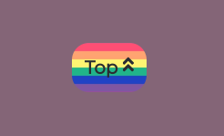
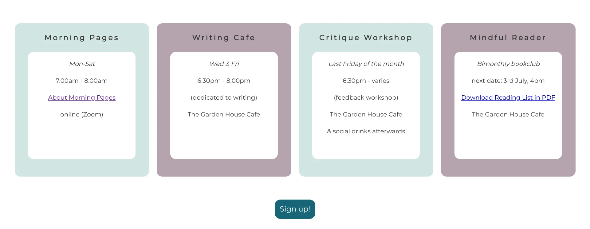

# Table of Contents 

1. [**Introduction**](#Introduction-&-Site-Purpose)   

2. [**User Experience (UX)**](#User-Experience-(UX))
* [Project goals](#Project-goals)
* [User Goals](#User-Goals)
* [Site Owner’s Goals](#Site-Owner’s-Goals)
* [Target audience](#Target-audience)
* [Research](#Research) 
* [Business goals](#Business-goals)
* [User stories](#User-stories)
* [Structure](#Structure)
* [Wireframes](#Wireframes)
* [Design](#Design) 

3. [**Features**](#Features)
* [Existing Features](#Existing-Features)
* [Features to be implemented in the future](#Features-to-be-implemented-in-the-future)

4. [**Technologies used**](#Technologies-used)
* [Languages](#Languages)
* [Frameworks, libraries and programs used](#Frameworks,-libraries-and-programs-used)

5. [**Deployment**](#Deployment)
* [Deploying to GitHub Pages](#Deploying-to-GitHub-Pages)
* [Forking to GitHub Repository](#Forking-to-GitHub-Repository)
* [Making a local clone](#Making-a-local-clone)

6. [**Testing**](#Testing)
* [Testing Approach](#Testing-Approach)
* [User stories testing from the UX section](#User-stories-testing-from-the-UX-section)
* [Validator Testing](#Validator-Testing)
* [Lighthouse Testing](#Lighthouse-Testing)
* [Further Testing](#Further-Testing)
* [Issues and Bugs](#Issues-and-Bugs)

7. [**Credits**](#Credits)
* [Code](#Code)
* [Images](#Images)
* [Content](#Content)
   
8. [**Acknowledgments**](#Acknowledgments)

9. [**Disclaimer**](#Disclaimer)

<br>

# Writing Room

[Visit live page here](https://renatabiniek.github.io/writing-room/)

<br>

## Introduction & Site Purpose
---

### Welcome to the Writing Room!
<br>


As a writer, an expat and a gay woman relocating from hectic East London to suburban Dublin on a quest for a slower, more mindful life, I have a first-hand understanding of the importance of a welcoming community who share the same interests. 
 
[Writing Room](https://renatabiniek.github.io/writing-room/) is a website for a creative writing and mindfulness group in Malahide and other towns in North County Dublin, Ireland. Its main purpose is to create an inclusive, safe and meaningful space (physical and online) for writers to write, develop and connect by sharing their stories. It hopes to promote creativity and mindfulness by organising regular topic specific events, workshops and meetups. 

The target audience are new and established writers of all backgrounds and nationalities who are looking to write regularly, grow and socialise together, and are based in the north areas of Dublin.

Writing Room site will be useful for local creatives as a platform to connect with like-minded people. Interested writers will be able to easily learn what local writing and mindfulness events are coming up and how they can join them. Geographical proximity of the event locations eliminates the long commute to Dublin city centre which might motivate any hesitant writers to meet and write regularly which will help them to achieve their creative goals.

## User Experience (UX)
---
### Project goals

* to provide a platform for creative adult community living in North County Dublin to connect and participate in a variety of events
* to promote creative writing and encourage regular writing routine by organising writing workshops and meetups
* to evoke interest in mindfulness and its benefits for creativity

### User Goals
* to have access to writing and mindfulness events that take place locally and can be attended regularly without long commute to the city center
* to find clear information on the group purpose, location and signing up process
* to learn more about mindfulness and the creative process
* to join the group by signing up for a selected event

### Site Owner’s Goals:
* to create online presence for the writing and mindfulness group in North County Dublin, Ireland
* to promote creative writing by organising writing events
* to gain new group members and create a community of like-minded people 

### Target audience for this website is:

* adult writers at any skill level and of all backgrounds 
* living in and around Malahide, Portmarnock, Kinsealy, Skerries and Swords, North County Dublin
* writers new to Dublin
* writers looking to get motivated to write regularly
* creative adults looking to connect and socialise within a like-minded community
* creative adults looking to slow down and introduce mindfulness into their creative process

### Research: 

While researching writing and creative groups in the area, I found that the majority of them are based in central Dublin. Long commutes can demotivate and discourage attending workshops and writing events regularly, alienating writers living in suburbia from the writing community. The very few groups in north parts of Dublin are either closed for new members or provide very limited group information and don’t have a dedicated website.  This project fills the gap by providing a clear and accessible platform to encourage creativity, mindfulness and foster a sense of a community for writers in a suburban area of Dublin.

### Business goals:

This site is based on the B2C model although the visit doesn’t finish with an actual purchase as all the events are free to join. It satisfies emotional triggers of the visitors to this site, provides them with clear and easily accessible information on the subject, and guides them to join the group by submitting the sign up form. It stands out as other writing groups have either no online presence or their websites have poor UX, or overcomplicated design and content overload.

### **User stories:**

* **First Time Visitor Goals:**

  * As a new visitor to the website, I want to immediately understand what the site’s purpose is so that I can decide if it’s what I’m looking for
 
  * As a visitor, I want to easily navigate the site so that I can find what I need efficiently
 
  * As a visitor, I want to immediately understand where the group is based so that I can decide if it’s relevant to me

* **Interested Visitor Goals:**

  * As a interested user, I want to see the schedule of current events so that I can decide if I want to attend
 
  * As an interested visitor, I want to know what the past events looked like so that I can decide if I’m interested in joining the group

  * As an interested visitor, I want to understand the signing up process so that I know how to join the selected event
 
  * As an interested visitor, I want to be able to download the reading list so that I can get ready to join the next bookclub
 
  * As an interested visitor, I want to be able to easily contact the site owner so that I can ask questions or share ideas
 
  * As an interested visitor, I want to be able to sign up for a newsletter so that I don’t miss any updates or events
 
  * As an interested visitor, I want to be able to easily find the social media pages of the group so that I can follow them for any updates

* **Frequent Visitor Goals:**

  * As a frequent user, I want to be able to access the site easily on my chosen device so that I can check the schedule on the go

* **Site Owner Goals:**

  * As a site owner, I want to create a site with great UX so that the users are inclined to return to it

  * As a site owner, I want to be able to be contacted from the users via a contact form and social media, so that I can communicate with them and answer any questions

### Structure:

The site has a simple layout of 2 pages with the home page containing the highest priority information, and the second page providing an option of further reading on mindful writing for interested visitors, without distracting them from the main content on the home page. 

Navigation elements are conventionally placed in a horizontal fashion at the top of the browser window. On their visit, the user lands on a page with an eye-catching hero image which includes a compelling slogan and a call to action button that encourages them to join the group. From here, the user can immediately tell if the group is of interest to them, as it conveys the purpose of the meetups and their location.

Further information is progressively disclosed as the user scrolls down through the page. The group ethos section allows the user to learn more about the group’s setup and benefits. Next, they are introduced to a short text on mindful writing with an option to read more by clicking on a hyperlink to the second page. They can either click it and once done, come back to the home page  or continue scrolling through the main page and visit the second page later by clicking the Mindful Pages section in the navbar. Next on the homepage, the user is taken to the events schedule where they can view all scheduled events at one glance. A join us button allows them to skip the rest of the content and go to the signup form immediately. Otherwise, the user continues to scroll down through the page to find a gallery to see what past events looked like and get reassured in joining the community. 

This is followed by a location page with a map,  a contact form and a footer with social media links and an option to sign up for a newsletter. From there, the user also can return to the top of the page by clicking the back-to-top button.
 
Links to events and contact pages are also presented in the navbar, to allow returning visitors to quickly access the information that will be of most relevance to them. 

For consistency of user experience, the site logo, navigation links and footer are repeated on the 2nd page. The second page contains a larger block of text accompanied by a decorative image and an option to go to events schedule. The user has an option to navigate back to the home page or go to the contact form as well via navbar links.

### Wireframes:

Low fidelity mock-ups were made using Balsamiq to help plan and visualise the navigation design, placement of information, features, relationship between the content and usefulness. They were created for 3 main screen sizes: mobile, tablet and desktop.

* [Wireframes - Home Page](docs/wireframes/home-page.pdf)
* [Wireframes - Morning Pages](docs/wireframes/morning-pages.pdf)


### Design:  

* **Colour scheme**
    
    The colour palette consists of calm, subdued colors that compliment each other and evoke mindful mood throughout the site. 
    
    Majority of them was derived from the hero image colours using [Eye Dropper](https://eyedropper.org/) and the remaining colours were added to the scheme using the colour scheme generator [Coolors](https://coolors.co/). White was used for text on buttons, for best contrast.  

    

    opal: #c5e0d8ff

    blue-sapphire: #186577ff 

    silver: #c9c9c9ff 

    old-lavender: #846577ff 

    gunmetal: #2a2d32ff 

    Apart from the above, white was used for text on buttons for best contrast.  
    <br>

* **Typography**

    The fonts were sourced from [Google Fonts](https://fonts.google.com/)

    **Courgette, cursive**
    Used for logo and headings, with cursive as a fallback font in case the original font family isn't imported correctly for some reason.
    I've chosen this font as it's imitating handwriting which supports the goal of the Writing Room group, focusing on creative writing and writing by hand. 

    **Montserrat, sans-serif**
    Main font for the body. This is a clean, popular and very readable font that I chose to contrast with the more decorative style of the logo and headings.
    Sans-serif is the fallback option.  
<br> 

* **Imagery**

    All images were sourced from [Unsplash](https://unsplash.com/), [Pexels](https://www.pexels.com/) and [Pixabay](https://pixabay.com/).
    
    Large image of a desk with typewriter and notebook was chosen for the hero image to serve as an illustration to the group purpose and serve as a clean background for the slogan and location information.

    Other images are used either as a decoration accompanying larger blocks of text to provide a balanced content and ensure user is not overloaded with text, or as the actual site content (gallery).
<br>

## Features
---

### Existing Features

* **Navigation**

Conventional horizontally aligned navigation bar with 4 navigation links exists on both pages.

The site logo is clickable and allows the user to return to the top of the homepage from any location on the site.


* **Landing Page with Hero Image**

Large hero image 


* Intro Section
[to add]
* Mindful Reading Section
[to add]
* Events Schedule
[to add]
* Gallery
[to add]
* Location
[to add]
* Contact Form
[to add]
* Footer
[to add]
* Morning Pages page
[to add]

### Features to be implemented in the future

Some features around interactivity and personalisation of the site are left to be implemented in the future due to either the limited expertise of the developer at this stage or lack of content.

* add an online booking option to allow the users book events directly via the site
* expand the events schedule section so that each event has its own description
* add a new page where the best stories written by Writing Room members are published
* add a new page with reading list for Mindful Reader Bookclub including blurbs
* hamburger menu which collapses navigation menu links on smaller screen sizes
* create a custom logo for the site and add it to the navbar
* add JavaScript to highlight Contact and Events menu links once the relevant section is active on the scrolling home page
* smooth scrolling with JavaScript for better UX

## Technologies used
---

### Languages

* [HTML5](https://en.wikipedia.org/wiki/HTML5)
* [CSS3](https://en.wikipedia.org/wiki/CSS)

### Frameworks, libraries and programs used

* [Balsamiq](https://balsamiq.com/) - to create wireframes for the site as part of the preparation work for the project
* [Google Fonts](https://fonts.google.com/) - to import Courgette and Montserrat fonts into the HTML file which were then used throughout the site
* [Font Awesome](https://fontawesome.com/) - to source icons which were added to headings for the purpose of aesthetics
* [Coolors](https://coolors.co/ ) - to create cohesive colour scheme for the site
* [Eye Dropper](https://eyedropper.org/) - to pick specific colours from images 
* [Pixlr](https://pixlr.com/) - to edit and resize photos
* [Chrome DevTools](https://developer.chrome.com/docs/devtools/) - to inspect and debug the code through all stages of the development
* [Unicorn Revealer](https://chrome.google.com/webstore/detail/unicorn-revealer/lmlkphhdlngaicolpmaakfmhplagoaln?hl=en-GB) - to inspect the site for overflow 
* [Lighthouse](https://developers.google.com/web/tools/lighthouse) - to audit the site for performance, accessibility, SEO and best practices
* [Am I Responsive](http://ami.responsivedesign.is/) - to produce a preview of the site on different devices
* [W3C HTML Validator](https://validator.w3.org/) - to validate HTML code
* [W3C CSS Validator](https://jigsaw.w3.org/css-validator/) - to validate CSS code
* [Color Contrast Accessibility Validator](https://color.a11y.com/Contrast/) - to test the contrast and readibility of colours used 
* [Autoprefixer](https://autoprefixer.github.io/) - to add vendor prefixes to CSS, for compatibility with different browsers
* [GitHub](https://github.com/) - for hosting the project code and version control 
* [Gitpod](https://gitpod.io/) - to write the code and push it to GitHub
* [GitHub Pages](https://pages.github.com/) - to deploy the site 
* [Word Counter](https://wordcounter.net/character-count) - to limit number of characters used for commit messages to 50, max 72 characters
* [Online-Spellcheck](https://www.online-spellcheck.com/) - to spellcheck the content
* [Unsplash](https://unsplash.com/) - for images
* [Pexels](https://www.pexels.com/) - for images
* [Pixabay](https://pixabay.com/) - for images


## Deployment
---
### Deploying to GitHub Pages

The project was developed in GitPod, commited to Git and pushed to GitHub. 
The site was deployed to GitHub Pages with the following steps:

1. Login to GitHub
2. Navigate to your site's repository, which for this project is renatabiniek/writing-room
3. At the top of the repository, locate and click **Settings** 
4. In the left-hand side panel, click **Pages**
5. Under **Source**, click the dropdown called *None* and select *Branch: Master* and *Root* folder
6. Click **Save**
7. A notification message will show up that the page is getting ready to be published
8. Once refreshed, the message will change to *Your site is published* and a link to the deplyed site will be provided: 

    The live link can be found here: https://renatabiniek.github.io/writing-room/

    

The process can also be found [here](https://docs.github.com/en/pages/getting-started-with-github-pages/configuring-a-publishing-source-for-your-github-pages-site).  

### Forking to GitHub Repository

You can create a fork (copy) of the repository. This allows you to experiment with the code without affecting the orignal project.

To fork the repository:

1. Log in to your [GitHub](https://github.com/) account 
2. On GitHub, navigate to the repository you want to fork
3. In the top right corner of the page, underneath your profile avatar, click **Fork**
4. You should now have a copy of the original repository in your GitHub account

### Making a local clone

You can clone your repository to create a local copy on your computer. Any changes made to the local copy will not affect the orignal project. To clone the **Writing Room** project, follow the steps below:

1. Log in to your [GitHub](https://github.com/) account and locate the [Writing Room repository](https://github.com/renatabiniek/writing-room)
2. In the repository, click on **Code** button located above all the project files
3. Under HTTPS, copy the link generated (https://github.com/renatabiniek/writing-room.git)
4. Open the terminal you're using, eg. Gitpod
5. Change the current working directory to the location where you want the cloned directory created
6. Type ```git clone``` and then paste the URL you copied earlier:  
```git clone https://github.com/renatabiniek/writing-room.git``` 
7. Press **Enter** to create your local clone.

You can also refer to this [GitHub documentation](https://docs.github.com/en/github/creating-cloning-and-archiving-repositories/cloning-a-repository-from-github/cloning-a-repository) for detailed intructions. 

## Testing
---

### **Testing Approach**  

I tested the site regularly during the development process, by regularly previewing it in the live server window and inspecting with Google Chrome DevTools at various breakpoints. Simultaneously, I was checking any new additions and changes on several devices available in my household. 
Any issues found, were addressed at that stage and double checked before moving on with the rest of the project.  

Only later in the project, I started using the element.style box in Google Chrome DevTools to play around with styling changes before implementing them into my actual code which could have saved me time and multiple commits for the same element. 

In the final stage of the project, I have tested the site thoroughly with automatic validators and manually on different devices and in several browsers, taking into account user stories from the UX section, as per below.

### **User stories testing from the UX section**
<br>

* **First Time Visitor Goals:**

  * As a new visitor to the website, I want to immediately understand what the site’s purpose is so that I can decide if it’s what I’m looking for
    
    **Test result:**  PASS

       
 
  * As a visitor, I want to easily navigate the site so that I can find what I need efficiently

    **Test result:** PASS

    
    
    
    
    
  * As a visitor, I want to immediately understand where the group is based so that I can decide if it’s relevant to me

    **Test result:**  PASS

    

* **Interested Visitor Goals:**

  * As a interested user, I want to see the schedule of current events so that I can decide if I want to attend
  
    **Test result:**  PASS

    

  * As an interested visitor, I want to know what the past events looked like so that I can decide if I’m interested in joining the group

    **Test result:**  PASS

    

    Gallery 
    

  * As an interested visitor, I want to understand the signing up process so that I know how to join the selected event
 
    **Test result:**  PASS

    
    
    

  * As an interested visitor, I want to be able to download the reading list so that I can get ready to join the next bookclub
 
    **Test result:**  PASS

    
    
  
  * As an interested visitor, I want to be able to easily contact the site owner so that I can ask questions or share ideas
 
    **Test result:** PASS

    
    

  * As an interested visitor, I want to be able to sign up for a newsletter so that I don’t miss any updates or events
    
    **Test result:**  PASS

    

  * As an interested visitor, I want to be able to easily find the social media pages of the group so that I can follow them for any updates

    **Test result:**  PASS

    

* **Frequent Visitor Goals:**

  * As a frequent user, I want to be able to access the site easily on my chosen device so that I can check the schedule on the go

    **Test result:**  PASS

    The site is fully responsive and easy to navigate on desktop, tablet and phone.

* **Site Owner Goals:**

  * As a site owner, I want to create a site with great UX so that the users are inclined to return to it

    **Test result:** PASS

    The site has a simple layout, with minimalistic design. It is easy to navigate, provides all the information a user might be interested in and allows to contact the site owner with any questions.

  * As a site owner, I want to be able to be contacted from the users via a contact form and social media, so that I can communicate with them and answer any questions

    **Test result:** PASS

    The site users can reach out to the site owner via a simple form. The form has validation in place that ensures name and email in correct format are provided so that the site owner can respond to the question or confirm the receipt of the sign up request. Social media links are displayed in the footer and open in a new window when clicked, so that the user doesn't exit the site.

  <br>

### **Validator Testing**

I ran the code through the HTML and CSS validators, and fixed the following initial warnings and issues:
<br>

* **HTML Validator Errors & Warnings**

  * **Warning:** Section lacks heading. Consider using h2-h6 elements to add identifying headings to all sections.

    **Fixed:** Changed p to h2 on the site slogan.

  * **Error:** Bad value 100% for attribute width on element iframe: Expected a digit but saw % instead. 

    **Fixed:** Changed the value from % to digits on iframe.

  * **Error:** Duplicate ID writing-cafe. & **Error:** Duplicate ID morning-pages.

    **Fixed both:** Change the IDs in the contact form to writing-session and morning-session.
  <br> 

* **CSS Validator Errors & Warnings:**

  * **Error:** line-height: auto is not a line-height value. 
  
    **Fixed:** corrected the line-height value with relative value.

<br>

I re-ran the deployed site in the final stages of the project and no warnings or error were found.
<br>

* **HTML Validator - Results**

    No warnings or errors to show for the deployed site.

  
<br>

* **CSS Validator - Results**

    No errors found for the deployed site.

    

<br> 

### **Lighthouse Testing**

I generated desktop and mobile Lighthouse reports from Google Chrome DevTools to review performance, SEO, best practices and accessibility of the site.  

  **Desktop**
  <br>

  
  <br>

  **Mobile**
  <br>

  

### **Further Testing**

  * **Links and buttons**

    All links and buttons have been repeatedly tested.
    Internal links and buttons take the user to the relevant section of the site.
    External links (social media, cafe and pub links) open in a new tab, leaving the site open.
    Link to the reading list in pdf opens the file in a new tab, leaving the current site open as well.

  * **Sign-up/ Contact form:**

    The contact form has validation in place for the required fields (name and email). Email field requires email address in the correct format.
    If the user tries to submit the form without the required information or with an invalid format of the email, error messages will pop up:

    
    

  * **Color Contrast**

    [Color Contrast Accessibility Validator](https://color.a11y.com/Contrast/)

    Initially, there was a contrast issue found between font colour on footer button and the fall back background colour of the button. 
    I've changed the background to white, and the final result is:

    *No automated color contrast issues found on the webpage tested*

  * **CI Peer Review**  

    I've asked fellow CI students to review the site and following points were raised:

    * *On Chrome the cover-text div is right to the edge of the screen, aligning this under the Title would keep a constant spacing throughout the site for you.*
     
      This was addressed by changing the padding value on the cover-text div.

    * *On PC and mobile when you select Events or Contact, Home is being set as the Active item*
      
      This is a known issue as Events and Contact are sections of the scrollable Home page and not separate pages. I will be able to fix once I progress trough the course with JavaScript.

  * **Family and friends**

    I've asked family and friends to test the site and no new issues were raised.

### **Devices and browsers tested**

  * Google Pixelbook Go Chromebook
  * HP EliteBook laptop 820 G4
  * 24inch ViewSonic LED monitor 
  * Google Pixel 4a phone
  * Samsung Galaxy A80 phone
  * iPad 5th generation
  * iPhone
  * all screen sizes in Google Chrome DevTools

  Browsers tested:

  At the final stages of the development, CSS has been prefixed with CSS vendor prefixes using https://autoprefixer.github.io/, to generate cross-browser compatibility code and ensure the site renders correctly on each browser. 
  Then the site was previewed in:

  * Google Chrome
  * FireFox
  * Microsoft Edge

  Internet Explorer is no longer supported so my testing didn't focus on IE.

### **Issues and Bugs**
  
  * **Fixed**:
  
    * I had issues with making the navbar and some sections of the site highly responsive, which I eventually solved after learning about flexbox and adding media queries
    * A white space appeared on the right hand side of the screen on smaller screens which was coming from the specific width of the navbar - this was changed to 100% and overflow-x:hidden was used for the site based [on this post](https://stackoverflow.com/questions/4617872/white-space-showing-up-on-right-side-of-page-when-background-image-should-extend)
    * Hero image was showing on top of the navbar on scrolling. This was fixed by adding z-index: 1000 to the navbar to keep it on top of the other content
    * List marker items on the Morning Pages page disappeared from view - this was fixed by moving them inside list item with list-style-position. They became part of text and were not affected anymore by any overflow: hidden setting
    * In Code Institute peer review, it was pointed out to me that text alignment of overlay cover text on here image and site logo was inconsistent on different devices. This was fixed by increasing left padding on overlay text on desktop and setting it smaller again in media query for smaller screens
    * In automatic code validation, invalid percentage value on width attribute for iframe was detected - I replaced it with digits
    * Thanks to the same validation, invalid auto value for line-height was noticed and replaced with correct value in the gallery section
    * There were a couple of duplicated ids caught as well and they were replaced with unique ones
    * Once the page was deployed initially, the images from gallery didn't load. I found that the file path had for them had an extra "/" in the address and removed it which fixed the issue
    * When testing different browsers, I found text-overflow on .flex-reasons > divs in Microsoft Edge - it was resolved by removing fixed height of the divs

      


  * **Known**:

    * When Events and Contact navigation links ara active, Home link is highlighted. This is because both Events and Contact refer to relevant sections on the same scrolling Home page. In my investigation, I found that should be able to highlight them as active on a scrolling page with JavaScript 
    * On some smaller screens, when a user scrolls down to the bottom of the form and tries to submit it without entering their name or email, the position of the validation error message displays on top of the current view elements. The view needs to scroll back up to the field the error message relates to. Based on my research and converation with tutor support team, this will need to be addressed with JavaScript
    
      

<br>
    
### Credits
---

#### Code

The Code Institute materials with the support of tutorial materials on [w3schools](https://www.w3schools.com/), [MDN Web Docs](https://developer.mozilla.org/en-US/) and posts on [stackoverflow](https://stackoverflow.com/) were used to create this site. 
All code seen in use there has been heavily modified to suit the needs of this site, except for the specific cases referenced below.

Reference materials from [w3schools](https://www.w3schools.com/css/css3_flexbox.asp) and [css-tricks](https://css-tricks.com/snippets/css/a-guide-to-flexbox/) were used to implement flexbox.

Blockquote code to separate a quote from other text and specify style of quotation marks was taken from [css-tricks](https://css-tricks.com/quoting-in-html-quotations-citations-and-blockquotes/)

Box shadow code was taken from [this MDN Web Docs post](https://developer.mozilla.org/en-US/docs/Web/CSS/box-shadow/)

Button shadow code was taken from [this w3schools post](https://www.w3schools.com/css/css3_buttons.asp/)

[This blog post](https://chris.beams.io/posts/git-commit/) was used for recommendation on best format of git commit messages

Icons taken from [Font Awesome](https://fontawesome.com/)

Overflow-x: hidden solution taken from [this Stackoverflow post](https://stackoverflow.com/questions/4617872/white-space-showing-up-on-right-side-of-page-when-background-image-should-extend)

<br>

#### Images 

Images were sourced from [Unsplash](https://unsplash.com/), [Pexels](https://www.pexels.com/) and [Pixabay](https://pixabay.com/). Thank you to all the photographers!

**Hero Image** by Annie Spratt on [Unsplash](https://unsplash.com/@anniespratt?utm_source=unsplash&utm_medium=referral&utm_content=creditCopyText)

**Intro Section Photo** by Sixteen Miles Out on [Unsplash](https://unsplash.com/photos/0I75875sRVU)

**Mindful Writing Photo** by Carli Jeen on [Unsplash](https://unsplash.com/photos/15YDf39RIVc)

**Gallery Images** by 

* Pexels on [Pixabay](https://pixabay.com/photos/adult-diary-journal-notebook-book-1850177/)
* StockSnap on [Pixabay](https://pixabay.com/photos/people-women-talking-laugh-happy-2567915/)
* Anthony Shkraba on [Pexels](https://www.pexels.com/photo/photo-of-woman-sitting-by-the-table-while-writing-4348078/)
* Alina Vilchenko on [Pexels](https://www.pexels.com/photo/photo-of-person-holding-cup-3363111/)
* furkanfdemir on [Pexels](https://www.pexels.com/photo/elderly-ethnic-stylish-man-taking-notes-in-planner-and-drinking-coffee-in-street-cafe-6309768/)
* Valeria Boltneva on [Pexels](https://www.pexels.com/photo/woman-in-white-and-blue-floral-crew-neck-short-sleeve-shirt-holding-a-teal-notebook-leaning-in-brown-tree-trunks-92333/)
* Keira Burton on [Pexels](https://www.pexels.com/photo/cheerful-multiethnic-students-with-notebooks-studying-at-table-6146997/)
* Nathan Dumlao on [Unsplash](https://unsplash.com/photos/6VhPY27jdps)

**Morning Pages Photo** by Kinga Cichewicz on [Unsplash](https://unsplash.com/photos/HYcXUU-mLwE)

**Rainbow Flag** used as background for footer button from [Pixabay](https://pixabay.com/users/katlove-636853/?utm_source=link-attribution&amp;utm_medium=referral&amp;utm_campaign=image&amp;utm_content=1792757)

<br>

#### Content

Text content for Mindful Writing section and Morning Pages page has been taken and adapted to suit the purpose of this project from the following sites:

[www.mindful.org](https://www.mindful.org/everyday-mindfulness-with-jon-kabat-zinn/)

[www.londonmindful.com](https://www.londonmindful.com/mindful-writing-workshop.html)

[https://shawnradcliffe.com](https://shawnradcliffe.com/mindfulness-writing-creative-thinking-meditation/)

[https://research.gold.ac.uk](https://research.gold.ac.uk/id/eprint/26035/3/FGilbert_NAWE_magazine_Jan_2019%20%20%282%29.pdf)

[https://juliacameronlive.com](https://juliacameronlive.com/basic-tools/morning-pages/)

[www.masterclass.com](https://www.masterclass.com/articles/tips-for-writing-morning-journal-pages#4-benefits-of-writing-morning-pages)

All other content was written by the developer.

<br>

### Acknowledgments
---
Massive thank you to:

* The wonderfully helpful and friendly Slack community where I often looked for help
* My mentor, Gerard McBride, for his guidance and helpful feedback
* Tutors at Code Institute for their support 

### Disclaimer
---
*Writing Room is an imaginary group and the content of this website is for educational purposes only. 
It was created for the Code Institute’s HTML and CSS Essentials Portfolio Project, as part of their Diploma in Full Stack Software Development.
The requirements are to make a static front-end website, using HTML and CSS.*
